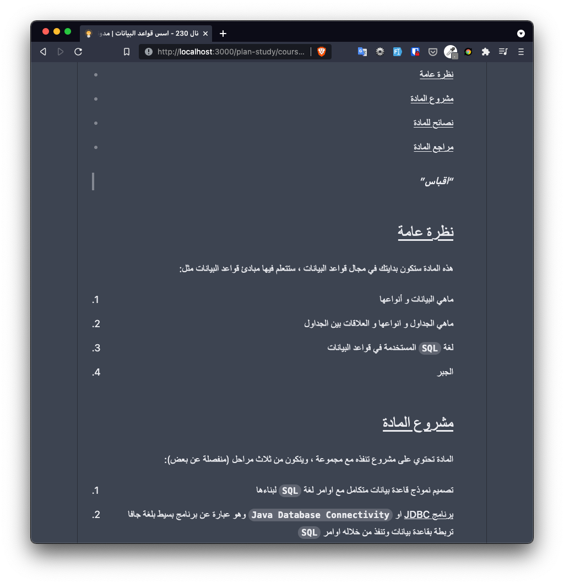
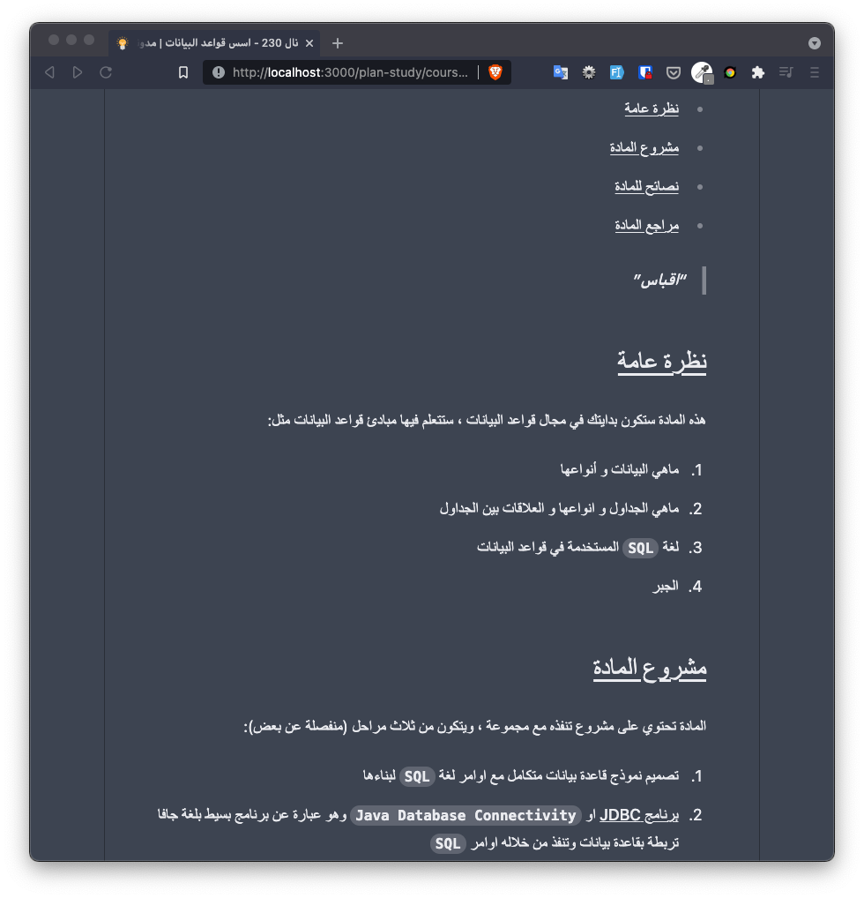

# @devmoath/tailwindcss-typography-rtl

Add RTL support for tailwindcss-typography plugin

## Problem description

if you are using [tailwindcss-typography](https://github.com/tailwindlabs/tailwindcss-typography) for RTL languages you will see the list point and blockquote border in the wrong direction (see the picture)



after using the plugin this issue should be fixed



## Installation

Install the plugin from npm:

```shell
# Using npm
npm install @devmoath/tailwindcss-typography-rtl

# Using Yarn
yarn add @devmoath/tailwindcss-typography-rtl
```

Then add the plugin to your tailwind.config.js file:

```javascript
// tailwind.config.js
module.exports = {
    theme: {
        // ...
    },
    plugins: [
        require('@tailwindcss/typography'),
        require('@devmoath/tailwindcss-typography-rtl'),
        // ...
    ],
};
```

## Usage

see the [tailwindcss-typography](https://github.com/tailwindlabs/tailwindcss-typography) usage
